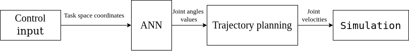

# Inverse Kinematics using ANN

## Project description

Utilizing Artificial Neural Network (ANN) to solve the inverse kinematics of a 6 DOF robotic arm with simulation in Webots using Universal Robots UR5e model.

## D-H parameters for UR5e robot model

https://www.universal-robots.com/articles/ur/application-installation/dh-parameters-for-calculations-of-kinematics-and-dynamics/

## Schematic diagram

***
